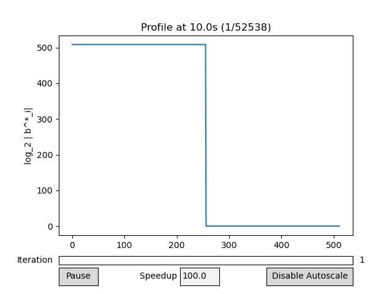
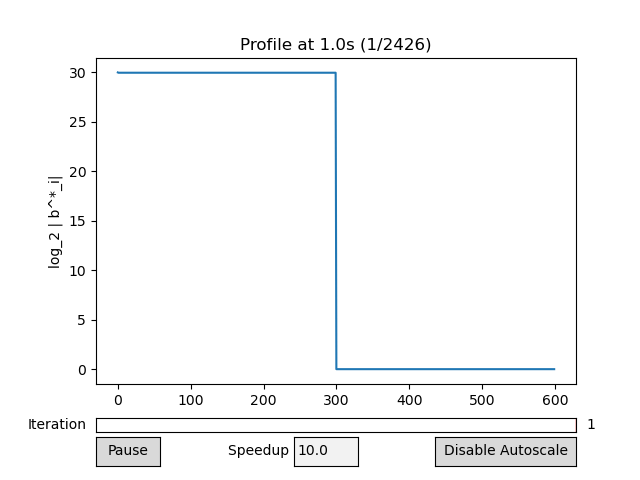
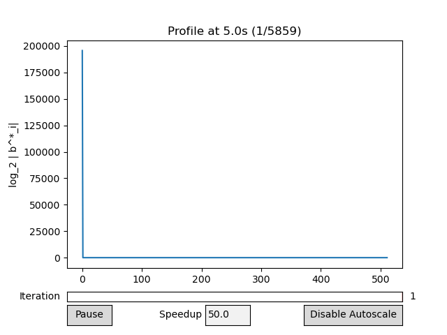
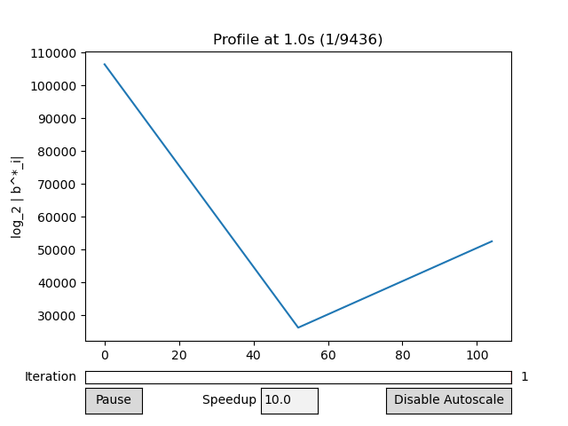
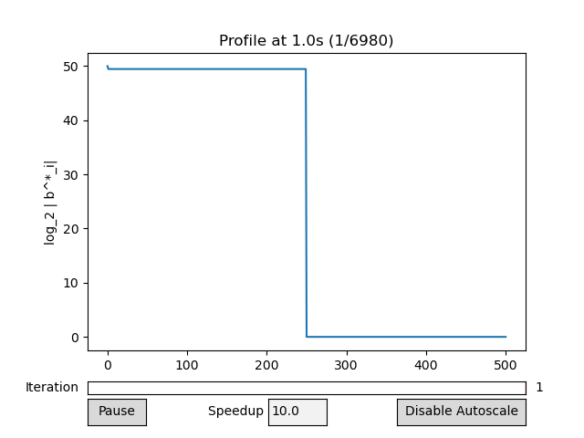
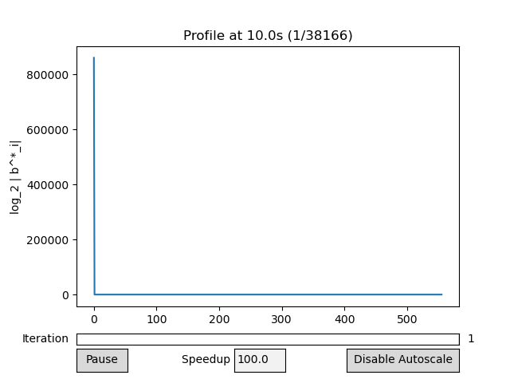
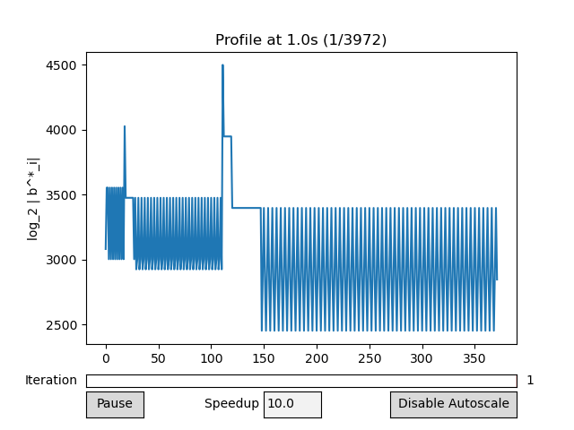

# Evolution of Lattice Profiles
We track the profile, or the log-norms of the Gram-Schmidt vectors, throughout the execution of our reduction algorithm. As our algorithm runs, the profile flattens out until the total decrease across the entire profile is small. Intuitively, a flat profile means that the first basis vector (corresponding to the left-most element of the profile) is not that much larger than $\det(B)^{1/n}$ (corresponding to the arithmetic mean of the profile). We show that defining reduction in terms of the profile is just as useful as the LLL definition of reduction. We refer to our paper for more information about our reduction algorithm and the test cases.

## $q$-ary

## NTRU

## Gentry-Halevi Fully Homomorphic Encryption
[Solving the toy challenge parameters](https://shaih.github.io/pubs/FHE-challenge-2010.html).

## RSA Factoring with High Bits Known

## Learning With Error (LWE)

## Partial Approximate Greatest Common Divisor (Partial AGCD)

## Modular Inversion Hidden Number Problem
